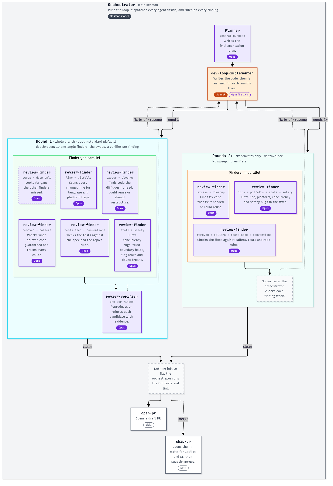

# dev-loop diagram

For people, not the skill: `SKILL.md` never links here, so a dev-loop run never loads it.

```mermaid
flowchart TD
  classDef opus fill:#ede9fe,stroke:#6d28d9
  classDef sonnet fill:#ffedd5,stroke:#c2410c
  classDef cond fill:#ede9fe,stroke:#6d28d9,stroke-dasharray:5 4
  classDef note fill:#f9fafb,stroke:#9ca3af,stroke-dasharray:3 3
  classDef skill fill:#ffffff,stroke:#6b7280

  subgraph O["<span style='font-family:ui-monospace,monospace;font-weight:700;font-size:16px;white-space:nowrap;color:rgb(17,24,39)'>Orchestrator</span> <span style='font-size:13px;color:rgb(75,85,99)'>· main session</span><br/><span style='font-size:13px;color:rgb(75,85,99)'>Runs the loop, dispatches every agent inside, and rules on every finding.</span><br/><span style='display:inline-block;white-space:nowrap;margin-top:6px;padding:2px 10px;border-radius:999px;font-size:11px;font-weight:600;color:white;background:rgb(55,65,81)'>Session model</span>"]
    direction TB
    P["<span style='font-family:ui-monospace,monospace;font-weight:700;font-size:15px;white-space:nowrap;color:rgb(17,24,39)'>Planner</span><br/><span style='font-family:ui-monospace,monospace;font-size:12px;white-space:nowrap;color:rgb(107,114,128)'>general-purpose</span><br/><span style='font-size:13px;color:rgb(75,85,99)'>Writes the implementation plan.</span><br/><span style='display:inline-block;white-space:nowrap;margin-top:6px;padding:2px 10px;border-radius:999px;font-size:11px;font-weight:600;color:white;background:rgb(109,40,217)'>Opus</span>"]:::opus
    I["<span style='font-family:ui-monospace,monospace;font-weight:700;font-size:15px;white-space:nowrap;color:rgb(17,24,39)'>dev-loop-implementer</span><br/><span style='font-size:13px;color:rgb(75,85,99)'>Writes the code, then is resumed for each round's fixes.</span><br/><span style='display:inline-block;white-space:nowrap;margin-top:6px;padding:2px 10px;border-radius:999px;font-size:11px;font-weight:600;color:white;background:rgb(194,65,12)'>Sonnet</span> <span style='display:inline-block;white-space:nowrap;margin-top:6px;padding:2px 10px;border-radius:999px;font-size:11px;font-weight:600;color:rgb(109,40,217);border:1px solid rgb(109,40,217)'>Opus if stuck</span>"]:::sonnet

    subgraph R2["<span style='font-family:ui-monospace,monospace;font-weight:700;font-size:16px;white-space:nowrap;color:rgb(17,24,39)'>Rounds 2+</span> <span style='font-size:13px;color:rgb(75,85,99)'>· fix commits only · depth=quick</span><br/><span style='font-size:13px;color:rgb(75,85,99)'>No sweep, no verifiers</span>"]
      direction TB
      subgraph R2F["Finders, in parallel"]
        direction TB
        Q1["<span style='font-family:ui-monospace,monospace;font-weight:700;font-size:15px;white-space:nowrap;color:rgb(17,24,39)'>review-finder</span><br/><span style='font-family:ui-monospace,monospace;font-size:12px;white-space:nowrap;color:rgb(107,114,128)'>line + pitfalls + state + safety</span><br/><span style='font-size:13px;color:rgb(75,85,99)'>Hunts line, platform, concurrency and safety bugs in the fixes.</span><br/><span style='display:inline-block;white-space:nowrap;margin-top:6px;padding:2px 10px;border-radius:999px;font-size:11px;font-weight:600;color:white;background:rgb(109,40,217)'>Opus</span><br/><span style='display:inline-block;white-space:nowrap;margin-top:6px;padding:2px 10px;border-radius:999px;font-size:11px;font-weight:600;color:rgb(107,114,128);border:1px solid rgb(107,114,128)'>+ thermo-nuclear-review</span>"]:::opus
        Q2["<span style='font-family:ui-monospace,monospace;font-weight:700;font-size:15px;white-space:nowrap;color:rgb(17,24,39)'>review-finder</span><br/><span style='font-family:ui-monospace,monospace;font-size:12px;white-space:nowrap;color:rgb(107,114,128)'>removed + callers + tests-spec + conventions</span><br/><span style='font-size:13px;color:rgb(75,85,99)'>Checks the fixes against callers, tests and repo rules.</span><br/><span style='display:inline-block;white-space:nowrap;margin-top:6px;padding:2px 10px;border-radius:999px;font-size:11px;font-weight:600;color:white;background:rgb(109,40,217)'>Opus</span>"]:::opus
        Q3["<span style='font-family:ui-monospace,monospace;font-weight:700;font-size:15px;white-space:nowrap;color:rgb(17,24,39)'>review-finder</span><br/><span style='font-family:ui-monospace,monospace;font-size:12px;white-space:nowrap;color:rgb(107,114,128)'>excess + cleanup</span><br/><span style='font-size:13px;color:rgb(75,85,99)'>Finds fix code that isn't needed or could reuse.</span><br/><span style='display:inline-block;white-space:nowrap;margin-top:6px;padding:2px 10px;border-radius:999px;font-size:11px;font-weight:600;color:white;background:rgb(109,40,217)'>Opus</span><br/><span style='display:inline-block;white-space:nowrap;margin-top:6px;padding:2px 10px;border-radius:999px;font-size:11px;font-weight:600;color:rgb(107,114,128);border:1px solid rgb(107,114,128)'>+ thermo-nuclear-code-quality-review</span>"]:::opus
        QU["<span style='font-family:ui-monospace,monospace;font-weight:700;font-size:15px;white-space:nowrap;color:rgb(17,24,39)'>review-finder</span><br/><span style='font-family:ui-monospace,monospace;font-size:12px;white-space:nowrap;color:rgb(107,114,128)'>ui · UI diffs only</span><br/><span style='font-size:13px;color:rgb(75,85,99)'>Checks UI fixes for accessibility, focus, motion and tokens.</span><br/><span style='display:inline-block;white-space:nowrap;margin-top:6px;padding:2px 10px;border-radius:999px;font-size:11px;font-weight:600;color:white;background:rgb(109,40,217)'>Opus</span><br/><span style='display:inline-block;white-space:nowrap;margin-top:6px;padding:2px 10px;border-radius:999px;font-size:11px;font-weight:600;color:rgb(107,114,128);border:1px solid rgb(107,114,128)'>+ web-design-guidelines</span> <span style='display:inline-block;white-space:nowrap;margin-top:6px;padding:2px 10px;border-radius:999px;font-size:11px;font-weight:600;color:rgb(107,114,128);border:1px solid rgb(107,114,128)'>+ impeccable audit</span>"]:::cond
      end
      QV["<span style='font-size:13px;color:rgb(75,85,99)'>No verifiers: the orchestrator checks each finding itself.</span>"]:::note
      R2F --> QV
    end

    subgraph R1["<span style='font-family:ui-monospace,monospace;font-weight:700;font-size:16px;white-space:nowrap;color:rgb(17,24,39)'>Round 1</span> <span style='font-size:13px;color:rgb(75,85,99)'>· whole branch · depth=standard (default)</span><br/><span style='font-size:13px;color:rgb(75,85,99)'>depth=deep: 10 one-angle finders, the sweep, a verifier per finding</span>"]
      direction TB
      subgraph R1F["Finders, in parallel"]
        direction TB
        F1["<span style='font-family:ui-monospace,monospace;font-weight:700;font-size:15px;white-space:nowrap;color:rgb(17,24,39)'>review-finder</span><br/><span style='font-family:ui-monospace,monospace;font-size:12px;white-space:nowrap;color:rgb(107,114,128)'>line + pitfalls</span><br/><span style='font-size:13px;color:rgb(75,85,99)'>Scans every changed line for language and platform traps.</span><br/><span style='display:inline-block;white-space:nowrap;margin-top:6px;padding:2px 10px;border-radius:999px;font-size:11px;font-weight:600;color:white;background:rgb(109,40,217)'>Opus</span>"]:::opus
        F2["<span style='font-family:ui-monospace,monospace;font-weight:700;font-size:15px;white-space:nowrap;color:rgb(17,24,39)'>review-finder</span><br/><span style='font-family:ui-monospace,monospace;font-size:12px;white-space:nowrap;color:rgb(107,114,128)'>removed + callers</span><br/><span style='font-size:13px;color:rgb(75,85,99)'>Checks what deleted code guaranteed and traces every caller.</span><br/><span style='display:inline-block;white-space:nowrap;margin-top:6px;padding:2px 10px;border-radius:999px;font-size:11px;font-weight:600;color:white;background:rgb(109,40,217)'>Opus</span>"]:::opus
        F3["<span style='font-family:ui-monospace,monospace;font-weight:700;font-size:15px;white-space:nowrap;color:rgb(17,24,39)'>review-finder</span><br/><span style='font-family:ui-monospace,monospace;font-size:12px;white-space:nowrap;color:rgb(107,114,128)'>state + safety</span><br/><span style='font-size:13px;color:rgb(75,85,99)'>Hunts concurrency bugs, trust-boundary holes, flag leaks and devex breaks.</span><br/><span style='display:inline-block;white-space:nowrap;margin-top:6px;padding:2px 10px;border-radius:999px;font-size:11px;font-weight:600;color:white;background:rgb(109,40,217)'>Opus</span><br/><span style='display:inline-block;white-space:nowrap;margin-top:6px;padding:2px 10px;border-radius:999px;font-size:11px;font-weight:600;color:rgb(107,114,128);border:1px solid rgb(107,114,128)'>+ thermo-nuclear-review</span>"]:::opus
        F4["<span style='font-family:ui-monospace,monospace;font-weight:700;font-size:15px;white-space:nowrap;color:rgb(17,24,39)'>review-finder</span><br/><span style='font-family:ui-monospace,monospace;font-size:12px;white-space:nowrap;color:rgb(107,114,128)'>tests-spec + conventions</span><br/><span style='font-size:13px;color:rgb(75,85,99)'>Checks the tests against the spec and the repo's rules.</span><br/><span style='display:inline-block;white-space:nowrap;margin-top:6px;padding:2px 10px;border-radius:999px;font-size:11px;font-weight:600;color:white;background:rgb(109,40,217)'>Opus</span>"]:::opus
        F5["<span style='font-family:ui-monospace,monospace;font-weight:700;font-size:15px;white-space:nowrap;color:rgb(17,24,39)'>review-finder</span><br/><span style='font-family:ui-monospace,monospace;font-size:12px;white-space:nowrap;color:rgb(107,114,128)'>excess + cleanup</span><br/><span style='font-size:13px;color:rgb(75,85,99)'>Finds code the diff doesn't need, could reuse or should restructure.</span><br/><span style='display:inline-block;white-space:nowrap;margin-top:6px;padding:2px 10px;border-radius:999px;font-size:11px;font-weight:600;color:white;background:rgb(109,40,217)'>Opus</span><br/><span style='display:inline-block;white-space:nowrap;margin-top:6px;padding:2px 10px;border-radius:999px;font-size:11px;font-weight:600;color:rgb(107,114,128);border:1px solid rgb(107,114,128)'>+ thermo-nuclear-code-quality-review</span>"]:::opus
        FU["<span style='font-family:ui-monospace,monospace;font-weight:700;font-size:15px;white-space:nowrap;color:rgb(17,24,39)'>review-finder</span><br/><span style='font-family:ui-monospace,monospace;font-size:12px;white-space:nowrap;color:rgb(107,114,128)'>ui · UI diffs only</span><br/><span style='font-size:13px;color:rgb(75,85,99)'>Checks UI changes for accessibility, focus, motion, contrast and design tokens.</span><br/><span style='display:inline-block;white-space:nowrap;margin-top:6px;padding:2px 10px;border-radius:999px;font-size:11px;font-weight:600;color:white;background:rgb(109,40,217)'>Opus</span><br/><span style='display:inline-block;white-space:nowrap;margin-top:6px;padding:2px 10px;border-radius:999px;font-size:11px;font-weight:600;color:rgb(107,114,128);border:1px solid rgb(107,114,128)'>+ web-design-guidelines</span> <span style='display:inline-block;white-space:nowrap;margin-top:6px;padding:2px 10px;border-radius:999px;font-size:11px;font-weight:600;color:rgb(107,114,128);border:1px solid rgb(107,114,128)'>+ impeccable audit</span>"]:::cond
        SW["<span style='font-family:ui-monospace,monospace;font-weight:700;font-size:15px;white-space:nowrap;color:rgb(17,24,39)'>review-finder</span><br/><span style='font-family:ui-monospace,monospace;font-size:12px;white-space:nowrap;color:rgb(107,114,128)'>sweep · deep only</span><br/><span style='font-size:13px;color:rgb(75,85,99)'>Looks for gaps the other finders missed.</span><br/><span style='display:inline-block;white-space:nowrap;margin-top:6px;padding:2px 10px;border-radius:999px;font-size:11px;font-weight:600;color:white;background:rgb(109,40,217)'>Opus</span>"]:::cond
      end
      V["<span style='font-family:ui-monospace,monospace;font-weight:700;font-size:15px;white-space:nowrap;color:rgb(17,24,39)'>review-verifier</span><br/><span style='font-family:ui-monospace,monospace;font-size:12px;white-space:nowrap;color:rgb(107,114,128)'>one per finder</span><br/><span style='font-size:13px;color:rgb(75,85,99)'>Reproduces or refutes each candidate with evidence.</span><br/><span style='display:inline-block;white-space:nowrap;margin-top:6px;padding:2px 10px;border-radius:999px;font-size:11px;font-weight:600;color:white;background:rgb(109,40,217)'>Opus</span>"]:::opus
      R1F --> V
    end

    T1["<span style='font-size:13px;color:rgb(75,85,99)'>Ticket: assigned to you, moved to In Progress.</span>"]:::note
    T2["<span style='font-size:13px;color:rgb(75,85,99)'>Ticket: moved to In Review.</span>"]:::note
    T3["<span style='font-size:13px;color:rgb(75,85,99)'>Ticket: moved to Done.</span>"]:::note
    DONE["<span style='font-size:13px;color:rgb(75,85,99)'>Nothing left to fix: the orchestrator runs the full tests and lint.</span>"]:::note
    OPEN["<span style='font-family:ui-monospace,monospace;font-weight:700;font-size:15px;white-space:nowrap;color:rgb(17,24,39)'>open-pr</span><br/><span style='font-size:13px;color:rgb(75,85,99)'>Opens a draft PR.</span><br/><span style='display:inline-block;white-space:nowrap;margin-top:6px;padding:2px 10px;border-radius:999px;font-size:11px;font-weight:600;color:rgb(107,114,128);border:1px solid rgb(107,114,128)'>Skill</span>"]:::skill
    SHIP["<span style='font-family:ui-monospace,monospace;font-weight:700;font-size:15px;white-space:nowrap;color:rgb(17,24,39)'>ship-pr</span><br/><span style='font-size:13px;color:rgb(75,85,99)'>Opens the PR, waits for Copilot and CI, then squash-merges.</span><br/><span style='display:inline-block;white-space:nowrap;margin-top:6px;padding:2px 10px;border-radius:999px;font-size:11px;font-weight:600;color:rgb(107,114,128);border:1px solid rgb(107,114,128)'>Skill</span>"]:::skill

    T1 --> P
    P --> I
    I -->|rounds 2+| R2
    I -->|round 1| R1
    V -.->|"fix brief · resume"| I
    QV -.->|"fix brief · resume"| I
    R2 & R1 -->|clean| DONE
    DONE --> OPEN
    DONE -.->|merge| SHIP
    OPEN --> T2
    SHIP --> T3
  end

  style O fill:#f3f4f6,stroke:#374151
```
